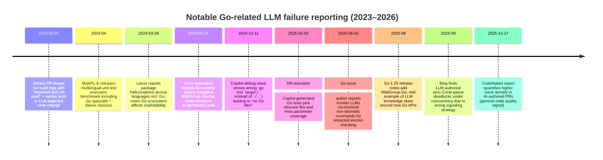

# Recent Evidence on LLM Failures When Generating Go Code

## Executive summary

Recent primary-source evidence (Feb 14, 2023–Feb 14, 2026) shows that LLMs fail at Go code generation in a pattern that is both **language-general** (hallucinating dependencies, producing uncompilable fragments, shallow “fixes”) and **Go-amplified** (imports as hard errors, package boundary mistakes, concurrency hazards, toolchain/module edge cases). citeturn18view0turn17view1turn13view3turn22view0turn25view0

Across evaluation-style sources, a recurring theme is that many failures are **not deep algorithmic mistakes** but **“surface correctness” gaps** that Go treats as build-stopping—e.g., missing/unused imports, mistaken `=` vs `:=`, wrong test package usage, and other compilation blockers. In one public benchmark write-up focused on Go/Java/Ruby, adding a small static “Go code repair” layer for a handful of common mistakes increased the share of Go responses that compile by **+29.34%** (and improved overall Go benchmark scores as well), implying those trivial-ish compile blockers are prevalent in model outputs. citeturn18view2turn18view0

Concurrency is the most consistently “Go-specific” failure cluster in real accounts: an LLM-authored concurrent priority queue deadlocked under high concurrency due to incorrect condition-variable signaling strategy (waking the wrong class of waiter), and a cross-language academic evaluation reports runtime panics in Go including **`sync: negative WaitGroup counter`** and index-out-of-range errors even after manual fixes—highlighting that concurrency and bounds reasoning issues can survive beyond compilation. citeturn17view0turn13view3

Version drift and toolchain nuance produce another Go-shaped failure mode: one developer reports an LLM “insisted” that the then-new `sync.WaitGroup.Go()` API did not exist (despite a successful build/test), illustrating how stale model knowledge can “hallucinate absence” and generate misguided refactors or unnecessary rewrites. The official Go 1.25 release notes confirm `WaitGroup.Go` was introduced in **August 2025**, making this a concrete, date-stamped example of **API knowledge skew** affecting Go code assistance. citeturn7view1turn7view2

Finally, dependency hallucination is now well-documented as a general LLM coding risk. A USENIX Security 2025 paper reports **19.7%** of generated packages were fictitious in their large-scale study of package hallucinations, and a separate security lab report explicitly includes Go in its multi-language hallucination measurements—while noting Go’s decentralized module ecosystem can make many hallucinated paths harder for attackers to squat (though still operationally harmful to developers). citeturn24view1turn26view1turn24view0

## Corpus and methodology

This report synthesizes primary and near-primary sources published within the last three years (relative to Feb 14, 2026), emphasizing:
- **Direct failure accounts** (developer blogs, issue trackers, pull request logs, “in the wild” tool debugging).
- **Hacker News discussions** as practitioner signal (anecdotal but often specific).
- **Academic evaluations** that include Go as a target language and report compile/runtime/correctness outcomes.
- **Official Go tooling/docs** to ground why certain mistakes are fatal and how mitigations work. citeturn17view0turn17view1turn8search13turn13view1turn13view3turn9search14turn9search2

Inclusion criteria were: (a) Go code generation or Go-adjacent tool usage with LLMs, and (b) concrete failures (compile logs, runtime panics, deadlock descriptions, tool invocation errors, dependency hallucination evidence), with (c) publication dates in-window when available from the source pages themselves. Where a page did not expose an exact publish date in the captured text, the report records the year and flags the uncertainty. citeturn27view0turn18view0turn24view0

## Source landscape and timeline

The table below summarizes a curated set of high-signal sources used in the analysis (blogs, Hacker News threads/comments, issue trackers, and papers). URLs are shown as inline code to satisfy the “URL” requirement while keeping them easily copyable.

| Title | Author | Date | URL | Type |
|---|---|---|---|---|
| OpenAI’s o1-preview is the king of code generation… (DevQualityEval v0.6) | entity["company","Symflower","software testing company"] | 2024 (date not visible in captured text) | `https://symflower.com/en/company/blog/2024/dev-quality-eval-v0.6-o1-preview-is-the-king-of-code-generation-but-is-super-slow-and-expensive/` | Benchmark blog / tooling report |
| Evaluating AI-generated code for C++, Fortran, Go, Java, … | entity["people","Peter Diehl","ai code eval paper"] et al. | 2024-05-21 | `https://arxiv.org/html/2405.13101v1` | Academic paper (arXiv) |
| Introducing smoke! | (blog author not identified in-page name snippet) | 2025-11-02 | `https://techiavellian.com/introducing-smoke/` | Blog post (developer account) |
| Go 1.25 Release Notes | entity["organization","The Go Team","go language maintainers"] | 2025-08 | `https://go.dev/doc/go1.25` | Official Go documentation |
| A Priority Queue with sync.Cond | (The Software Life blog) | 2025-09 | `https://thesoftwarelife.blogspot.com/2025/09/a-priority-queue-with-synccond.html` | Blog post (developer account) |
| Ask HN: What is interviewing like now… (comment about Go tests) | Hacker News user (hnlmorg thread context) | 2025-02-02 | `https://news.ycombinator.com/item?id=42909166` | Hacker News thread/comment |
| update to gpt-3.5-turbo PR (Go compile errors in logs) | GitHub users in PR discussion | 2023-03-31 | `https://github.com/ZYallers/chatgpt_wechat_robot/pull/2` | GitHub PR / build log |
| proposal: cmd/go: ‘mod tidy’ should check for retracted versions | entity["people","Kevin Burke","go modules proposal author"] | 2025-06-02 | `https://github.com/golang/go/issues/73952` | Go issue tracker (tooling) |
| copilot-debug inject wrong arguments (.) instead of (./...) | entity["company","Microsoft","software company"] (repo owner) | 2024-12-11 | `https://github.com/microsoft/vscode-copilot-release/issues/3180` | Product issue tracker (tool invocation) |
| Repeated errors, unable to self-correct | Microsoft (repo owner) | 2025-01-07 (approx; issue age shown as 1.1y at capture time) | `https://github.com/microsoft/vscode-copilot-release/issues/3900` | Product issue tracker (LLM behavior) |
| Running LLM-Generated Go Code in a Docker Container | (rasc.ch blog) | 2025-01-17 | `https://blog.rasc.ch/2025/01/llmgodocker.html` | Blog post (mitigation workflow) |
| MultiPL-E: A scalable and polyglot approach… | (authors listed in PDF) | 2023 (accepted TSE; author version) | `https://par.nsf.gov/servlets/purl/10416465` | Academic paper (multilingual benchmark) |
| Multi-lingual evaluation of code generation models (MBXP) | (paper on Amazon Science) | 2023 (ICLR) | `https://assets.amazon.science/21/98/7a6c43264136863dbbe619014787/multi-lingual-evaluation-of-code-generation-models.pdf` | Academic paper (multilingual eval) |
| We have a package for you! (package hallucinations) | entity["people","Joseph Spracklen","package hallucination paper"] et al. | 2025 (USENIX Security) | `https://www.usenix.org/system/files/usenixsecurity25-spracklen.pdf` | Academic security paper |
| Diving Deeper into AI Package Hallucinations | entity["people","Bar Lanyado","lasso security researcher"] | 2024-03-28 | `https://www.lasso.security/blog/ai-package-hallucinations` | Security research blog |
| State of AI vs Human Code Generation Report | entity["company","CodeRabbit","ai code review company"] | 2025-12-17 | `https://www.coderabbit.ai/blog/state-of-ai-vs-human-code-generation-report` | Industry report (general) |

Notable reports over time (selected) illustrate how the discourse shifted from “compilation blockers and missing imports” to richer failure taxonomies including concurrency, toolchain nuance, and supply-chain risk:


citeturn17view1turn13view1turn24view0turn13view3turn22view2turn8search13turn22view0turn7view2turn17view0turn20search0

## Failure modes in Go code generation

### Taxonomy visualization

The taxonomy below groups observed failures into Go-amplified compilation/tooling issues, semantic/runtime issues (including concurrency), and ecosystem risks (dependencies and versions).

```mermaid
flowchart TD
  A[LLM generates Go code] --> B{Does it compile?}
  B -- No --> C[Compilation blockers]
  C --> C1[Missing imports]
  C --> C2[Unused imports]
  C --> C3[Undefined identifiers / := vs =]
  C --> C4[Bad package/test package usage]
  C --> C5[Syntax truncation / missing braces]
  C --> C6[Gofmt/goimports/tooling mismatch]

  B -- Yes --> D{Does it pass tests / run correctly?}
  D -- No --> E[Runtime & semantic bugs]
  E --> E1[Incorrect algorithm / wrong outputs]
  E --> E2[Panics (bounds, nil, etc.)]
  E --> E3[Concurrency bugs]
  E3 --> E31[WaitGroup misuse]
  E3 --> E32[Deadlocks (channels, Cond)]
  E3 --> E33[Goroutine leaks / cancellation errors]
  E3 --> E34[Races / unsafe shared state]
  E --> E4[Error handling mistakes]
  E --> E5[Performance pathologies]

  A --> F[Ecosystem & project-level failures]
  F --> F1[Go module/version skew]
  F --> F2[Toolchain/go mod tidy confusion]
  F --> F3[Hallucinated dependencies / supply-chain risk]
  F --> F4[Cross-file context gaps]
```
citeturn18view0turn17view1turn13view3turn22view0turn25view0turn26view1turn22view2

### Mode-by-mode analysis with examples, indicators, root causes, mitigations

The following table maps each failure mode to representative examples and discusses occurrence indicators and mitigations. Code/log excerpts are intentionally short; see the linked sources for full context.

| Failure mode | What it looks like in Go | Representative example (snippet/log) | Evidence sources | Occurrence indicators | Root causes (typical) | Mitigations (practical) |
|---|---|---|---|---|---|---|
| Missing imports | Refers to `pkg.Symbol` without importing `pkg` | “Missing imports: referencing a declaration of a package without importing it.” | Symflower DevQualityEval notes it as one of four most common compile errors they auto-repair | Common enough that fixing a small set of Go compile mistakes increased compiling outputs by +29.34% | LLM emits plausible identifiers and assumes IDE auto-import; works in languages/tooling where imports are optional or warnings | Run `goimports` (adds missing + removes unused + gofmt); enforce compile-in-loop | 
| Unused imports | Imports that are never referenced (hard error) | From a real `go run`: `imported and not used: "net/http"` (among others) | chatgpt_wechat_robot PR log; Symflower identifies unused imports as common compile blocker; Go tooling docs explain goimports removes unreferenced imports | Appears frequently both in anecdotal logs and benchmark “static repair” candidates | LLM “front-loads” imports defensively; later edits remove usages but not imports; incomplete refactors | `goimports` on save/CI; prompt the model to output *minimal imports only*; compile feedback loop |
| Undefined identifiers / `:=` vs `=` | Uses `=` where Go requires `:=` for new vars; undefined `y` | Symflower’s “variableUnknown” case highlights this exact pattern | Symflower DevQualityEval | Included in the short list of “common mistakes” worth automatic repair | LLM generalizes from other languages; loses track of whether a name is newly introduced vs existing | “Let the compiler talk” (compile errors fed back); ask the model to list new vars it introduces; static code repair for `=`→`:=` when safe |
| Incorrect test packaging (“black-box” misuse) | Writes `package foo_test` then tries calling unexported `foo.bar()` | ```go\npackage plain_test\nimport (\n  \"testing\"\n  \"plain\"\n)\nfunc TestPlain(t *testing.T){\n  plain.plain()\n}\n``` | Symflower shows this failure happening in model outputs | Common enough to be singled out as a recurring compile error class in DevQualityEval | Confusion about Go export rules (capitalization), package scoping, and the `_test` convention | Prompt explicitly: “tests must be in the same package unless only public API”; add CI that fails `go test ./...`; teach via template tests |
| Bad `go test` invocation / tooling target errors | Runs tests in wrong directory/target; `.` vs `./...` | `Build Error: go test ... -l .` → `no Go files in /user/examples` | Copilot-debug issue shows a concrete tool-driven failure | Tooling errors can block *any* progress even if code is correct | LLM tool wrappers guess targets; repository structure or cwd differs; command rewriting bugs | Always echo/print exact commands; validate cwd + module root; run `go env GOMOD` to confirm context before `go test` |
| Syntax truncation / malformed code | Unterminated string, missing braces/params | `gpt/gpt.go:64:17: string not terminated` | chatgpt_wechat_robot PR log; Symflower “code repair” task includes missing bracket/type cases | Appears in real logs; benchmark includes multiple syntax-repair scenarios | Token-limit truncation; partial edits; model returns fenced code with extra text; multi-file context loss | Enforce “code-only” outputs; auto-strip markdown fences; re-run `gofmt`; compile and retry with stderr fed back (with stop condition) |
| Concurrency misuse: WaitGroup counter errors | `Done()` called too many times; Add/Wait misuse | Reported crash: `panic: sync: negative WaitGroup counter` | arXiv evaluation for Go; Go `vet` analyzer doc shows typical WaitGroup misuse pattern | Observed as runtime crash in evaluation; Go tooling specifically has an analyzer for WaitGroup misuse | LLMs emulate patterns without invariants; difficulty reasoning about concurrency “counts” and lifetimes | Use `go vet` analyzer `waitgroup`; prefer `errgroup`/structured concurrency; insist on tests + race detector in loop |
| Concurrency misuse: Cond/Signal deadlock | Uses one `sync.Cond` and `Signal`, wakes wrong waiter under contention | Deadlock cause summarized: waking a producer when queue full (or consumer when empty) | Priority queue blog | Demonstrated deadlock at high concurrency (16/32 threads) after seeming fine at low concurrency | LLM picks “textbook” Cond pattern but misses two-condition design; weak adversarial scheduling intuition | Prefer channels or higher-level sync when possible; if Cond needed, use separate conditions or `Broadcast`; add `synctest`/stress tests |
| Runtime panics: bounds / indexing | Index-out-of-range, negative index, etc. | `panic: runtime error: index out of range [-1] with length 101` | arXiv evaluation for Go | Observed even after manual compilation fixes | LLM produces algorithm skeleton but off-by-one; insufficient invariant reasoning; tests missing edge cases | Table-driven tests with boundaries; property tests; run under `-race`; ask model to enumerate edge cases *before* coding |
| Go version / API knowledge skew | Model says an API does not exist (or exists) based on stale cutoff | LLM insisted `WaitGroup.Go()` “did not exist,” though code built/tests passed | smoke blog; Go 1.25 release notes confirm `WaitGroup.Go` added in Aug 2025 | Likely to grow with rapid stdlib/toolchain changes | Version ambiguity (“which Go?”); stale training; missing tool use (gopls, docs) | Always specify target Go version in prompt; wire model to `gopls` + `go doc`; include docs excerpt in context if needed |
| Module & ecosystem advice errors | Recommends non-idiomatic/incorrect go tool commands | In a Go tool proposal: “No frontier LLM … suggests using … `go get` … they suggest running e.g. `go list ... | jq ...`” | golang/go issue #73952 | Practitioner evidence that even strong models miss native Go workflows for niche module features | Rare/long-tail tool features underrepresented; models pattern-match shell pipelines | Provide “known-good” recipes in org docs; prefer Go tool outputs (`go get`, `go list -m` flags) over ad-hoc parsing; encode checks in CI |
| Dependency / package hallucination | Suggests packages that do not exist (or misleading paths) | Large-scale estimate: “19.7% of generated packages are fictitious” | USENIX Security paper; Lasso research includes Go in multi-language hallucination study | Security research gives concrete rates across models/settings | LLMs optimize plausible names; retrieval failure; training contamination; weak verification | Dependency allowlists; SCA scanning; require `go mod tidy` + review diffs; “verify existence” step for any new module |
| Go-specific “partial protection” nuance | Hallucinated Go module paths may be harder to squat | “In GO… many … pointed to repositories that don't exist but the username in path does or pointed to domains already taken” | Lasso research | Not a reduction in hallucination frequency, but a change in exploitability | Go modules depend on domain/path control; attackers can’t always publish at arbitrary paths | Still treat as failure: it wastes time, can mislead; mitigate by searching modules, pinning known sources, and using internal module proxies |

citeturn18view0turn18view2turn17view1turn9search2turn22view2turn13view3turn9search14turn17view0turn7view1turn7view2turn22view0turn24view1turn26view1

A few particularly “Go-shaped” examples are worth calling out in expository form:

- **Black-box test packaging error**: benchmark evidence shows models choose `package X_test` (a valid Go idiom) but then call unexported internals, causing compilation failure. This is not merely a “missing symbol” mistake; it reflects misunderstanding of Go’s *package-level encapsulation* and how tests relate to it. citeturn18view0  
- **WaitGroup misuse**: Go’s official analysis tooling explicitly warns that calling `WaitGroup.Add` inside a launched goroutine can race with `Wait`, potentially returning prematurely; the presence of a dedicated analyzer underscores that these mistakes are common in human code and thus likely to be mirrored (and amplified) by models. citeturn9search14  
- **sync.Cond deadlock**: real-world debugging of an LLM-written structure showed “works under light load, deadlocks under heavy load,” a hallmark of concurrency bugs that LLMs struggle to anticipate because they require adversarial scheduling imagination and invariants about queue state vs waiter type. citeturn17view0  

## Root causes and Go-specific amplifiers

LLM coding failures in Go frequently look “worse” than in some other languages because Go combines (a) a strict compiler and (b) a productivity culture that assumes tooling will keep code tidy. This creates a sharp bimodality: either the output is close-to-correct and toolable, or it fails loudly and immediately.

**Go amplifiers (language and toolchain traits)**

Go turns a number of mistakes into **hard errors** rather than warnings. Unused imports are a canonical example; the go toolchain rejects them, and tooling like `goimports` exists specifically to add missing imports and remove unreferenced imports automatically. LLMs often generate “kitchen sink” imports while drafting and then fail to reconcile them after edits—producing friction that is more visible than in ecosystems where unused imports are warnings. citeturn9search2turn17view1turn18view0

Go’s package boundary model is simple but unforgiving: tests in a separate `*_test` package cannot reach unexported identifiers. The DevQualityEval report highlights that models frequently choose the black-box style but then violate its constraints, causing compilation failures. This is a language-design *boundary error* that is easy for humans to understand after one explanation but easy for models to overlook when generating from pattern fragments. citeturn18view0

Concurrency in Go is deliberately “low-level accessible” (goroutines, channels, `sync` primitives), and the Go project explicitly acknowledges concurrency is powerful but hard to test and reason about; the Go blog points out that testing concurrent programs can be difficult and error-prone, motivating features like `testing/synctest`. LLMs inherit the same difficulty but lack the embodied experience of chasing heisenbugs, so they overproduce superficially plausible patterns that fail under stress. citeturn9search25turn17view0turn13view3

Finally, Go’s fast-moving toolchain and ecosystem features (modules, directives, version-aware behavior) introduce a special failure mode: **stale advice** that is syntactically valid but semantically obsolete. The `WaitGroup.Go` episode is illustrative: the model confidently tried to “fix” code by removing a method it believed was nonexistent, while official docs confirm the method was introduced in Go 1.25 (Aug 2025). citeturn7view1turn7view2

**General LLM coding root causes (language-agnostic, but visible in Go)**

A repeated theme across sources is that LLMs lack reliable “introspection” unless explicitly wired into tools: they may repeat the same wrong import or “fix” by copying the original code and explaining changes that aren’t present. This behavior is documented in product issue reports and is a major reason Go users gravitate toward compile/test-in-the-loop workflows rather than pure prompting. citeturn17view2turn22view1

Additionally, when dependencies are involved, LLMs can output plausible but nonexistent packages (package hallucination). The most comprehensive academic security study in this area reports a high fictitious-package rate (19.7%) and argues the phenomenon is systemic and persistent, motivating mitigation strategies like RAG and verification. While that finding is not Go-only, it interacts with Go’s `go.mod` workflow: a hallucinated module path can derail builds, confuse developers, and potentially create supply-chain risk (even if some hallucinated Go paths are harder to squat due to domain ownership constraints). citeturn24view1turn26view1

## Mitigation strategies and evaluation practices

The central lesson across sources is that **tooling feedback must be part of the loop**. In Go, the natural “safety rails” are already there: `go test`, `go vet`, `gofmt`, and `goimports`. The best-performing mitigation patterns in the sources are variants of “generate → compile/test → feed errors back → repair,” with careful stopping conditions.

### Tight compile/test/tool loop as the default

A practical pattern is explicitly described in a Go-centric blog implementation: generate Go code, run it in a container, and if execution fails or stderr is non-empty, feed the error back for a retry—**but with a maximum retry count** to avoid infinite loops. This is an instance of “execution-guided repair” that is especially effective for Go’s crisp compiler errors. citeturn22view1

Where evaluation frameworks exist, adding lightweight *post-processing* repair for common Go compile errors has measurable benefits: DevQualityEval’s static Go repair focuses on missing imports, unused imports, `:=` vs `=`, and black-box testing package misuse, and reports a substantial increase in compilable outputs (+29.34%). Even if you do not use their tooling, the principle generalizes: auto-fix what is easy, reserve human review for semantics. citeturn18view0turn18view2

### Concurrency-specific guardrails

For concurrency-heavy prompts, treat LLM output as a draft and enforce structured checks:

- Run `go vet` (including the WaitGroup misuse analyzer) to catch at least one class of common synchronization error: calling `Add` inside a goroutine racing with `Wait`. citeturn9search14turn7view2  
- Add adversarial tests: stress runs, race detector, and (where applicable) deterministic concurrency tests (`testing/synctest`) to surface deadlocks and goroutine leaks earlier. citeturn9search25turn17view0  
- Prefer high-level patterns (e.g., structured concurrency style via context + errgroup-like patterns) and insist the model explain *shutdown*, *cancellation*, and *backpressure* decisions in plain language before writing code.

### Module/version hygiene as prompt and process “inputs”

When the Go version matters, specify it explicitly in the task prompt and in the build environment, and encourage the model to consult tool output rather than memory. The `WaitGroup.Go` incident demonstrates how a version mismatch can invert the model’s confidence (it “hallucinates absence” of a real API). citeturn7view1turn7view2

For niche Go module features (e.g., retractions), practitioner evidence suggests frontier models may still recommend non-idiomatic workarounds or miss the native Go tool workflow, so teams should encode these checks into CI using canonical Go commands rather than ad-hoc parsing. citeturn22view0

### Dependency hallucination defenses

Given high measured rates of package hallucination in code-generating contexts, adopt “trust but verify” controls:

- Require a “dependency diff” step: every new import/module must be justified and verified to exist and be reputable (stars/maintenance/license), with `go.mod` changes reviewed like security-sensitive diffs. citeturn24view1turn26view1  
- Use SCA and allowlists/denylists; don’t let autonomous agents install new dependencies without human review.  
- Treat “Go is safer because modules are decentralized” as a partial mitigation at best: it may reduce easy squatting for some hallucinated paths, but it does not prevent developer time loss or misconfiguration risk. citeturn26view1

### Relating Go-specific failures to general LLM code quality findings

General empirical signals suggest AI-authored code changes can carry higher issue density and require more review effort. One industry report analyzing hundreds of open-source PRs reports AI-coauthored PRs contain **more issues overall** than human-only PRs (normalized comparisons and issue taxonomies), reinforcing the need for strict CI gates and review checklists—especially in languages like Go where small compile/tooling mistakes fully block the pipeline. citeturn20search0turn18view2